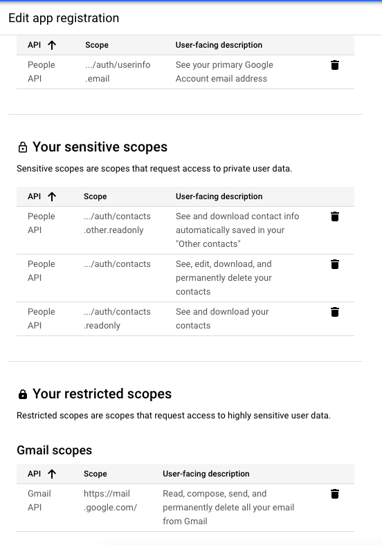

# SimpleGmail

All the APIs are developed in node js & frontend in vuejs

### Prerequisites

* Please open the following ports 
  ```
  4000 port for frontend
  4080 port for the webserver 
  ```
  
* if you want to set up the SSL we recommend using this URL and following for Nginx 
  * https://tecadmin.net/how-to-setup-lets-encrypt-on-ubuntu-20-04/
  

### Domain Setup

- To configure any domain you have to set up the Nginx Reverse Proxy on your Ubuntu system, you can follow this article for more detail 

  https://www.hostinger.in/tutorials/how-to-set-up-nginx-reverse-proxy/

  Make sure you set the port `4000` so that your configured domain opens the URL on that specific port 

### Environment Variables 

-  Following variables you need to change as per your requirements in ```docker-compose.yml```
  - ```GOOGLE_CREDENTIALS``` //A JSON used to authenticate with google for the sign-in process (Check Google sign-in setup section)
  - ```JWT_SECRET``` //Secret used to verify JWT Token
  - ```DB_NAME``` //MongoDB database name
  - ```FRONT_URL``` //You need to change it with your origin domain

### Google sign-in setup 

- You have to set up the google credentials, please follow the below setups and generate the JSON file and replace it with ```GOOGLE_CREDENTIALS```
https://developers.google.com/workspace/guides/create-credentials

- You also have to set up the OAuth consent 
https://developers.google.com/workspace/guides/configure-oauth-consent

- Following scopes you have to define while configuring Oauth Consent form 




### Installation

1. Clone the repo
   ```sh
   git clone git@github.com:raisingthefloor/rtf-simplegmail.git
   ```

2. Switch to the main branch
   ```sh
   git checkout main
   ```

3. Build docker image from source using the composer command
   ```sh
   docker-compose build --no-cache
   ```

4. Run the docker image
    ```sh
     docker-compose up -d
